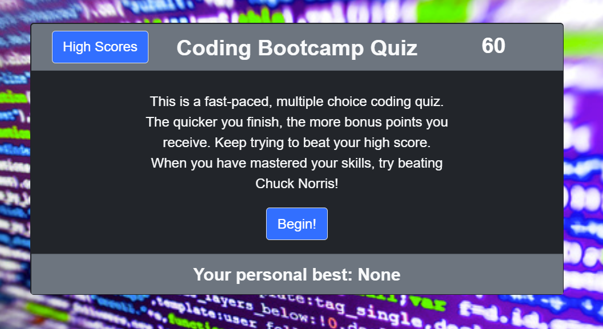

# Password Generator
TABLE OF CONTENTS
1. Purpose
2. Preview
3. License 

## PURPOSE

The goal of this project is to design a coding quiz to test Javascipt knowledge. The underlying purpose is to practice my own ability to create dynamically updated webpages, with audio, Bootstrap, and timer functionality. The quiz is intended to be fast paced. You must study the questions well in order to beat Chuck Norris!

## PREVIEW

https://jrdavis4.github.io/coding_quiz/

## License

Song is The Final Countdown (Instrumental) by The Magic Orchestra.
Sound effects from Ninento's Smash TV.
All other content is public domain, help yourself!
